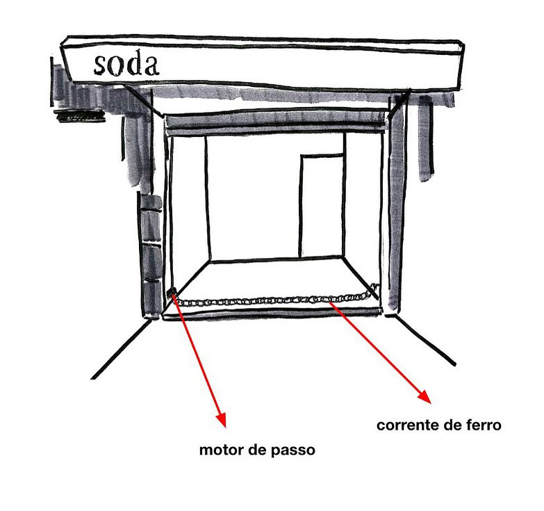

# Corrente

O trabalho consiste em uma corrente em movimento pendular senoidal 

 Desenho                                               | Imagem 
:-----------------------------------------------------:|:----------------------------------------:
 | 

## Materiais

- Arduino Uno
- Fonte para o Arduino
- Corrente de 3m
- Motor de passo Nema 23
- Driver controlador do motor
- Fonte para o motor
- Jumpers
- Protoboard
- Olhal para prender a outra ponta na parede

Motor de passo Nema 23                                 | Driver controlador do motor 
:-----------------------------------------------------:|:----------------------------------------:
 | 
